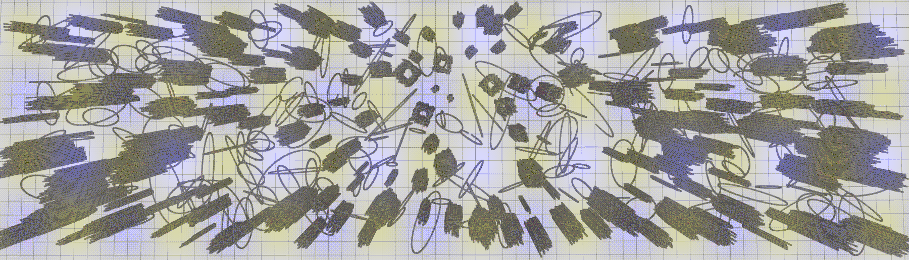
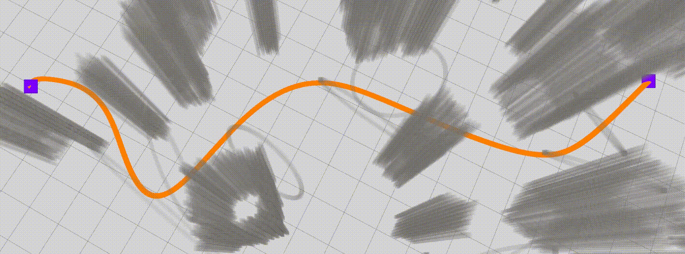

# kRRT* with fast RO
Front-end: Kinodynamic RRT* integrated with fast regional optimization. 
<p align="center">
  
</p>

Back-end: Quadratic programming incorporating obstacles.
<p align="center">
  
</p>

##  About
Planning global kinodynamic trajectories for multirotor flight.

__Authors__: [Hongkai YE](https://kyleyehh.github.io/) and [Fei GAO](https://ustfei.com/) from the [ZJU Fast Lab](http://www.kivact.com/).

__Related Paper__:
Integrating Fast Regional Optimization into Sampling-based Kinodynamic Planning for Multirotor Flight. 

[[Preprint]](https://arxiv.org/abs/2103.05519), 
[[Bilibili]](https://www.bilibili.com/video/BV1L5411P7GV/), 
[[YouTube]](https://www.youtube.com/watch?v=gJ6ttY34iWA)

## Run The Simulation
The repo has been tested on Ubuntu 16.04 and 18.04 with ros-desktop-full installation.
By default, we use 16.04 with ROS-kinetic. If use 18.04 or above, pleause modify the last code lines in so3_control_nodelet.cpp according to the comments:

### 1. Prerequisites
The __uav_simulator__ depends on the C++ linear algebra library [Armadillo](http://arma.sourceforge.net/). You can install it by:
```
~$ sudo apt-get install libarmadillo-dev
``` 
### 2. Build on ROS
We recommand create a new catkin workspace:
```
~$ mkdir -p krrt_with_ro_ws/src
```
Change directory to _~/krrt_with_ro_ws/src_ and clone the repo:
```
~$ cd krrt_with_ro_ws/src
~/krrt_with_ro_ws/src$ git clone https://github.com/kyleYehh/kino_sampling_with_regional_opti
```
Change directory to _~/krrt_with_ro_ws_ and make:
```
~/krrt_with_ro_ws/src$ cd ..
~/krrt_with_ro_ws$ catkin_make
```

### 3. Run 
In directory _~/krrt_with_ro_ws_, set up the environment and launch the simulator:
```
~/krrt_with_ro_ws$ source devel/setup.bash
~/krrt_with_ro_ws$ roslaunch state_machine rviz.launch
```

Open another terminal, set up the environment and launch the planner:
```
~/krrt_with_ro_ws$ source devel/setup.bash
~/krrt_with_ro_ws$ roslaunch state_machine planning.launch
```
If everything goes well, you should be able to navigate the drone as the gif shows below. (Click 3D Nav Goal in the Rviz panel or press g in keyboard to selecet goal. Click down both left and right mouse buttons and drag to change the goal altitude.)

<p align="center">
  
</p>


## Differences from the paper
1. Instead of inflating the occupancy map, we compute a distance field which provides the distance to the nearest obstacle for each grid, and any grid with a distance less than a predetermined length is considered occupied.